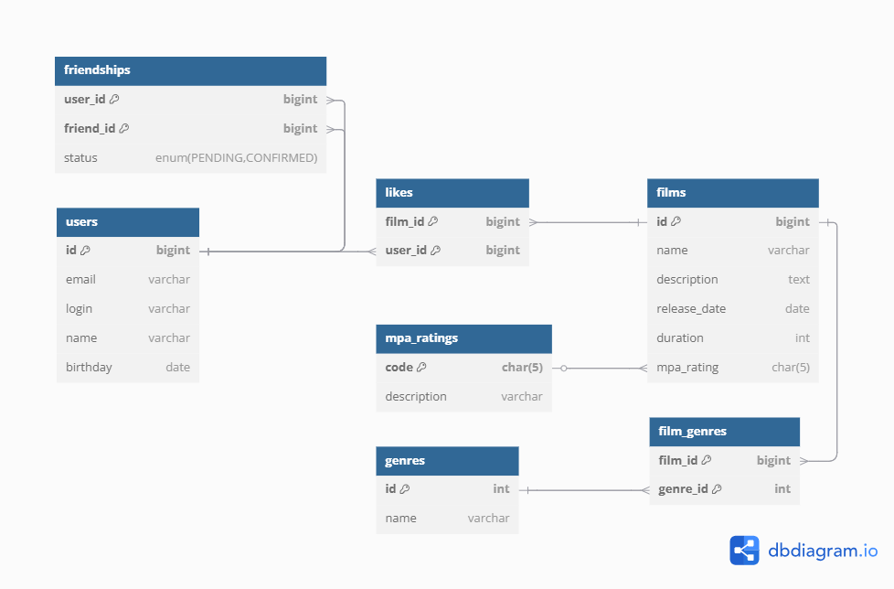
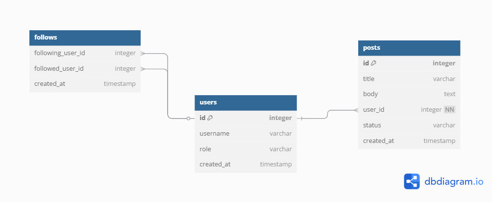

# java-filmorate
Template repository for Filmorate project.

## ER-диаграмма базы данных

-- Получить всех пользователей
SELECT * 
FROM users;

-- Получить фильм по ID с MPA и жанрами
SELECT f.*, m.description AS mpa
FROM films f
JOIN mpa_ratings m ON f.mpa_rating = m.code
WHERE f.id = :filmId;

-- Топ-N популярных фильмов
SELECT f.*, COUNT(l.user_id) AS likes_count
FROM films f
LEFT JOIN like l ON f.id = l.film_id
GROUP BY f.id
ORDER BY likes_count DESC
LIMIT :count;

-- Список друзей
SELECT u.*
FROM users u
JOIN friendship fr ON u.id = fr.friend_id
WHERE fr.user_id = :userId
AND fr.status = 'CONFIRMED';

-- Общие друзья двух пользователей
SELECT u.*
FROM users u
JOIN friendship f1 ON u.id = f1.friend_id
AND f1.user_id = :userA
AND f1.status = 'CONFIRMED'
JOIN friendship f2 ON u.id = f2.friend_id
AND f2.user_id = :userB
AND f2.status = 'CONFIRMED';
